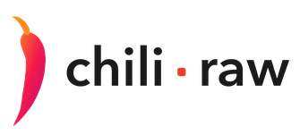

<picture>
  <source media="(prefers-color-scheme: dark)" srcset="assets/wordmark-dark.png">
  
</picture>

### A photo culler, RAW developer, and asset manager, built just for the modern Mac.

`macOS 15+`  `Apple silicon`  `v1.0.0`  `Free forever`  `Pro $29.99 once`  `No subscription`

Chili RAW takes a card full of frames and gets you to finished pictures — cull the shoot,
develop the keepers, and keep your whole library searchable, all in one window and all on
your own disk. It never imports, copies, or uploads a single file.

It runs on Apple silicon and nothing else. The develop pipeline is built on Metal and
Core Image, the AI runs on the Neural Engine, and the interface is native AppKit and
SwiftUI rather than an imitation of one.

<table>
<tr>
<td width="33%"><b>DOWNLOAD</b> <a href="https://github.com/halebop17/chili-raw-photo-developer/releases/latest">Get the latest release&nbsp;→</a> Free, fully featured, no account.</td>
<td width="33%"><b>MANUAL</b> <a href="https://github.com/halebop17/chili-raw-photo-developer/wiki">Open the manual&nbsp;→</a> Every part of the app, chapter by chapter.</td>
<td width="33%"><b>SOMETHING WRONG?</b> <a href="https://github.com/halebop17/chili-raw-photo-developer/issues">File an issue&nbsp;→</a> Read and answered in public.</td>
</tr>
</table>

---

## Free, and free forever

**Chili RAW Free is a real photo application, not a trial.** It is its own build — not the
paid one with features switched off — and it stays free.

- No time limit, no watermark, no export cap.
- **Nothing interrupts you to sell you something.** No nag screens, no upgrade prompts, no countdown timers.
- **Nothing is padlocked.** Pro features aren't greyed-out teasers; they simply aren't in this build.
- No account. Nothing to sign in to.
- Every future release of Free stays free.

---

## What it does

### Cull
Ratings, picks, rejects and colour flags from the keyboard · burst **Stacks** · **Compare**
and **Survey** side-by-side modes · a hover **Loupe** with focus peaking · a distraction-free
Darkroom · an on-device Vision score that puts the likely keepers first.

### Develop
**Three RAW decoders you choose between** — Apple CIRAWFilter, the Adobe DNG SDK, and LibRaw
with your own DCP profiles — and **three tone mappers** (AgX, Standard, Neutral), so the same
raw file has nine starting points before you touch a slider.

Tone, curves, colour mixing, texture, clarity and physical dehaze · RAW highlight recovery ·
**eleven kinds of mask** that add, subtract and intersect · heal, clone and cross-frame dust
detection · crop, straighten, perspective · **lens corrections** from your camera's own tables
or the bundled Lensfun database · multiple **versions** per photo · **Proof** mode.

### Organise
A searchable catalog with Smart Folders and Collections · text search across filenames, IPTC
and Vision keywords · geotagging with **offline** place names — no geocoding service, no network
request · EXIF/IPTC editing in bulk · Vault backups to another drive.

### Export
JPEG (jpegli), JPEG XL, HEIC, 16-bit TIFF and layered PSD · resize with output sharpening ·
batch renaming, metadata policy, GPS and person-info stripping · a processing panel that
doesn't block the app.

### Video
Clips sit in the grid with the photos, play full screen, and take a colour grade applied
frame by frame on export — HEVC or H.264, in a MOV or MP4.

---

## What Pro adds

Pro is for what you *make* with the app, and costs **$29.99 once** — no subscription, updates included.

<!-- TODO: point this at the Payhip page once the URL exists. -->
**[Get Chili RAW Pro → ](#)** *(link coming — Pro is sold through Payhip, which also handles the licence key)*

| | |
|---|---|
| **Film Labor** | Eighteen film stocks and eight papers, each modelled from published datasheets, run through the stages a real frame goes through: exposure onto the negative, halation, grain, the print, and the light you view it under. |
| **Pixels** | A layer canvas over the developed photo — type, borders, glowing date stamps, dithered gradient washes, a Deluxe-Paint palette, and **Enlarge**. Exports as a layered PSD or TIFF. |
| **AI, on your Mac** | Sky, Object and Depth masks · portrait editing by face part · Generative Remove · AI denoise · upscaling on export · search by what's in the picture · People. |
| **Bokeh** | A depth-driven optical blur, run in scene-linear before the tone map, with a five, six or seven-blade iris. |

---

## Installing

1. Download the `.dmg` from [Releases](https://github.com/halebop17/chili-raw-photo-developer/releases/latest).
2. Drag **Chili RAW** to your Applications folder.
3. Open it.

<!-- TODO: once notarization is in the release pipeline, say so here — until then,
     macOS may ask you to confirm the first launch (right-click ▸ Open). -->

---

## Requirements

|  |  |
|---|---|
| **macOS** | 15 Sequoia or later |
| **Chip** | Apple silicon — M1 or newer |
| **Intel** | Not supported |

---

## Privacy

- **Your photos stay where they are.** Chili RAW reads folders on your disk. It never imports, copies or moves your originals, and never overwrites your pixels.
- **No account, no telemetry, no analytics, no crash reporting.**
- **The app makes exactly one kind of network request:** downloading an AI model, when you press Download. Nothing else in it talks to the internet — place names come from a table inside the app, and no image ever leaves your Mac.

---

## Bugs, requests, questions

Open an [issue](https://github.com/halebop17/chili-raw-photo-developer/issues). For anything
that looks like a bug, four things make it fixable in one pass:

- your macOS version and Mac model,
- the camera and file type (`.ARW`, `.CR3`, `.NEF`, `.DNG`, …),
- which RAW decoder you have selected in **Settings ▸ General ▸ RAW decoding**,
- what you expected to see, and what you saw instead.

---

© 2026 <!-- TODO: your name or company -->  ·  Not affiliated with Adobe, Apple, Fujifilm,
Kodak or any other manufacturer named in the app. 
Film and paper names identify the stock being emulated; the emulations are built from
published datasheets and are not replicas.

